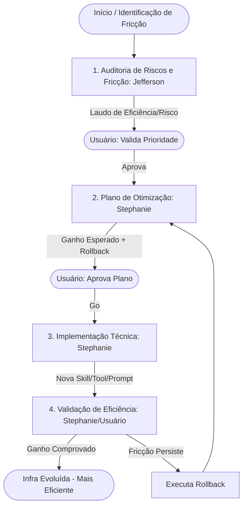

# Evolução de Infraestrutura Operacional (Infra Evolve)

## Instructions

Esta skill é a ferramenta de "meta-melhoria" da equipe. O objetivo central não é apenas a segurança, mas a **EFICIÊNCIA**. Evoluir a infraestrutura significa identificar gargalos nos processos dos agentes e implementar melhorias (novas skills, prompts mais precisos, tools mais potentes) que permitam entregar valor mais rápido e com maior qualidade.

Sempre que for detectado que um processo é lento, repetitivo ou propenso a erros, a `infra-evolve` deve ser acionada para "subir a régua" da capacidade da equipe.

Atue como o **Orquestrador** deste fluxo, garantindo que a busca por velocidade não comprometa a estabilidade do sistema.

### 1. Auditoria de Riscos e Fricções (Delegação: Agente Jefferson)

Antes de qualquer mudança, analisamos o que está travando a eficiência e quais os riscos da alteração.

- **Modo de Descoberta**: Se a skill for invocada sem objetivo, o `jefferson` deve realizar um scan estrutural completo da pasta `.pi/` para identificar a causa raiz de ineficiências, analisando redundâncias em skills, clareza de prompts, organização de arquivos e lacunas de ferramentas. Ele deve correlacionar esses achados estruturais com os sintomas encontrados em tarefas recentes (analisando `EXECUTION-REPORT.md` e `AUDITORIA.md`) para mapear padrões de fricção e gargalos sistêmicos.
- **Modo Direcionado**: Invoque o **`jefferson`** via **teammates** para analisar a fricção específica reportada.
- **Objetivo:**
  - **Identificar Fricções:** Onde o processo atual é lento? Onde os agentes se perdem?
  - **Mapear Riscos:** Qual o risco de a nova "melhoria" introduzir bugs, alucinações ou quebrar fluxos existentes?
- **Entrega:** Um "Laudo de Auditoria de Eficiência e Riscos", apontando o gargalo atual e os perigos da mudança proposta.
- **Interação:** Se o Jefferson identificar riscos críticos, apresente-os ao usuário e **aguarde a decisão** sobre como proceder.

### 2. Plano de Otimização e Mitigação (Delegação: Agente Stephanie)

A Tech Lead desenha a solução para eliminar a fricção e mitigar os riscos.

- Invoque a **`stephanie`** via **teammates** fornecendo o laudo do Jefferson.
- **Objetivo:** Elaborar um plano técnico para aumentar a eficiência.
  - **No Modo de Descoberta:** A Stephanie deve priorizar a otimização do gargalo de maior impacto identificado pelo Jefferson.
  - **No Modo Direcionado:** A Stephanie resolve a fricção específica apontada.
  - O plano deve conter:
    - **A Solução de Eficiência:** (Ex: "Criar a skill X", "Refinar o prompt Y", "Implementar a tool Z").
    - **Ganhos Esperados:** Como isso impactará a velocidade/qualidade?
    - **Plano de Rollback:** Como reverter a alteração se a eficiência cair ou o sistema quebrar.
    - **Critérios de Sucesso:** Como mediremos que a tarefa agora é concluída mais rapidamente?
- **Entrega:** O arquivo `.artifacts/<tarefa-infra>/PLANO-OTIMIZACAO.md`.
- **Interação:** Apresente o plano ao usuário e **aguarde a aprovação**.

### 3. Implementação Técnica (Delegação: Agente Stephanie)

Execução da melhoria na infraestrutura operacional.

- Invoque a **`stephanie`** via **teammates** para codificar a nova skill, ajustar o prompt ou criar a tool.
- **Objetivo:** Implementar a melhoria rigorosamente conforme o plano, garantindo que a nova "peça" da infraestrutura esteja integrada e funcional.
- **Evidência:** Diffs de arquivos, novos arquivos de skill ou logs de teste da tool.

### 4. Validação de Eficiência e Encerramento (Delegação: Usuário/Stephanie)

Validamos se a "alma" da tarefa (a eficiência) foi atingida.

- A **`stephanie`** realiza os testes técnicos iniciais.
- Invoque o **`cliente`** para validar se a nova infraestrutura realmente tornou a execução de tarefas mais fluida, rápida e qualitativa.
- **Encerramento:** Uma vez comprovado o ganho de eficiência, o processo é concluído.

## Fluxo Visual

## Rules

- **Foco na Eficiência**: Não aceite melhorias que não tragam um ganho claro de velocidade ou qualidade. Se a mudança é "apenas cosmética", ela não pertence a esta skill.
- **Priorizar Trava Técnica sobre Instrução Comportamental**: Para maximizar o determinismo e eliminar alucinações, deve-se preferir a implementação via código (validadores, tipos, constraints) em vez de apenas instruções em prompts.
- **Segurança como Base**: A eficiência nunca deve vir às custas da estabilidade. O laudo do Jefferson é a trava de segurança.
- **Rollback Obrigatório**: Toda alteração de "cérebro" (prompts/skills) deve ter um caminho de retorno rápido.

## Examples

**Input (Modo Direcionado):**
`/infra-evolve otimizar-delegacao-aelin-belle`

**Output:**
**Identificado gargalo na delegação Aelin -> Belle. Invocando `jefferson` para analisar fricções e riscos...**

[Jefferson apresenta laudo: "Fricção: Aelin gasta muitos tokens decidindo quando delegar. Risco: Delegação excessiva pode fragmentar o contexto do EXECUTION-REPORT."]
_A fricção foi mapeada. Deseja que a Stephanie planeje a otimização do fluxo de delegação?_ (Aguarde usuário)

**Input (Modo de Descoberta):**
`/infra-evolve`

**Output:**
**Modo de Descoberta ativado. Invocando `jefferson` para scan proativo de fricções em tarefas recentes...**

[Jefferson analisa reports recentes e identifica: "Gargalo: A equipe está perdendo tempo repetindo a leitura de arquivos de configuração em cada subtask".]
_Jefferson identificou um gargalo sistêmico de redundância de leitura. Deseja que a Stephanie planeje a otimização deste ponto?_ (Aguarde usuário)
