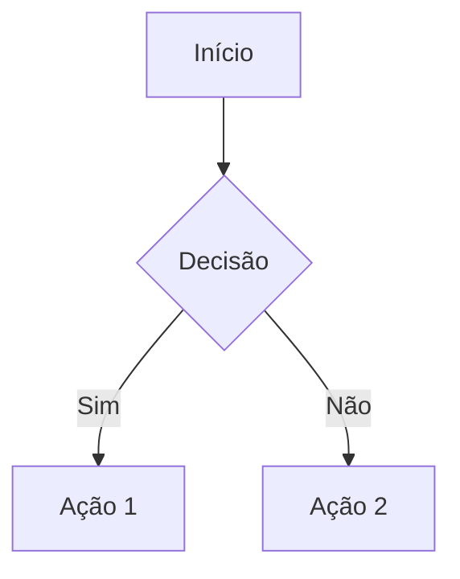

# Arquitetura: [Nome da Funcionalidade/Módulo]

## Visão Técnica

Descrição da abordagem técnica adotada para a implementação.

## Decisões de Arquitetura (ADR)

Registro de decisões técnicas críticas.

### [Título da Decisão]

- **Contexto**: [Qual era o problema/necessidade]
- **Decisão**: [O que foi decidido e por que]
- **Consequências**: [Impactos positivos e negativos da decisão]

## Modelagem de Dados

Descrição das entidades envolvidas e seus relacionamentos.

- **Entidade X**: [Propósito e campos principais]
- **Relacionamentos**: [X $\rightarrow$ Y (1:N), etc]

## Diagramas

Utilize a sintaxe Mermaid para representar fluxos ou estruturas.

