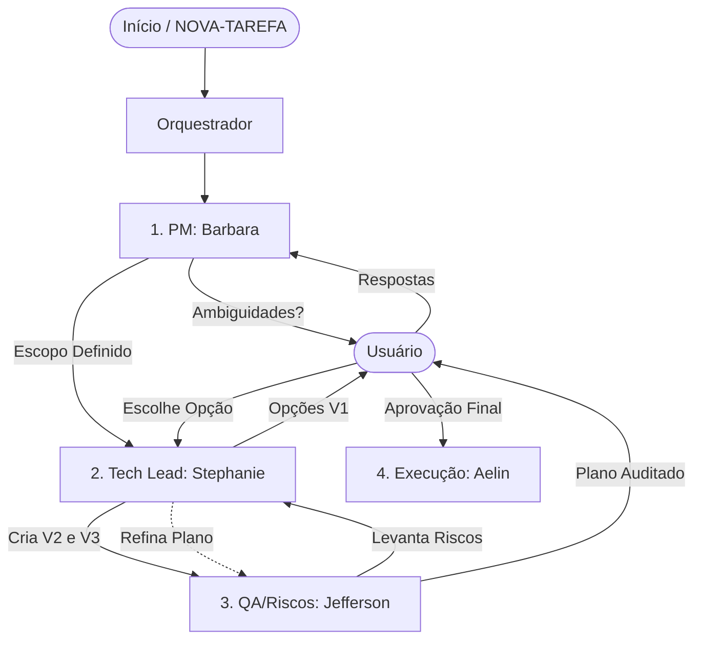

# Planejar Tarefa

## Instructions

Para orquestrar esta skill, você deve acionar a **Tech Lead (Stephanie)** logo no início e passar a requisição para ela. Ela possui autonomia para conduzir todo o fluxo e invocar os demais especialistas (Barbara e Jefferson) conforme as fases abaixo. Você atuará apenas como o **Despachante e Orquestrador Inicial**.

**Antes de qualquer ação, consulte `code/PROJECT-REFERENCE.md` para conhecer hooks, componentes e padrões disponíveis — isso evita reimplementar o que já existe.**

Nota: se for fornecido um código de tarefa como argumento, busque os dados iniciais usando o comando `just backlog-list --limit 1 code=<código>` e trate a saída como o conteúdo de `NOVA-TAREFA.<nome-da-tarefa>.md` para iniciar o fluxo.

### 1. Definição de Escopo (Delegação: Agente Barbara)

A primeira etapa é isolar ambiguidades e extrair todas as regras de negócio de `NOVA-TAREFA.*.md` e do repositório de documentos `.context/project/product/`.

- A **`barbara`** deve ser invocada pela Tech Lead via **teammates** para explorar os requisitos, cruzar com a base de conhecimento e gerar o "Relatório de Execução Segura".
- **Interação:** Se a Barbara encontrar ambiguidades, apresente as dúvidas geradas por ela ao usuário e **aguarde as respostas** antes de avançar.

### 2. Planejamento Arquitetural (Delegação: Agente Stephanie)

Com o escopo da Barbara alinhado, passe o trabalho de engenharia para a Tech Lead.

- A **`stephanie`** tomará posse do Relatório da Barbara e das respostas do usuário para orquestrar as V1/V2.
- O objetivo da Stephanie é redigir o `.artifacts/<nome-da-tarefa>/PLANO.md` e suas opções arquiteturais.
- **Ação V1:** Instrua a Stephanie a apresentar no mínimo 2 opções de solução (V1 - Visão Geral).
- **Interação:** Exiba as propostas para o usuário e pergunte _"Qual opção técnica você deseja seguir?"_, depois **aguarde a decisão**.

### 3. V2, V3 e Auditoria de Riscos (Delegação: Agente Jefferson)

Com a opção escolhida pelo usuário:

- A **`stephanie`** fechará o passo a passo (V2) e especificações/contratos (V3).
- ANTES de aprovar o passo a passo como definitivo para o desenvolvimento, a **`stephanie`** deve invocar o **`jefferson`** via **teammates** para que este analise criticamente a V2/V3 gerada. Ele procurará por cenários "unhappy path", falhas de arquitetura e edge cases.
- Repasse as pontuações e riscos levantados pelo `jefferson` para que a `stephanie` fortaleça e atualize as seções no `PLANO.md`.

### 4. Transição para Execução (Delegação: Agente Aelin)

Quando o `PLANO.md` (V3) estiver finalmente auditado pelos três, mitigado de riscos e em sua versão mais fina, confirmada pelo usuário:

- **Encerramento:** Conclua o processo de planejamento técnico (Task Plan).
- **Aviso:** Indique explicitamente ao usuário que agora o comando `/task-execute` deve ser chamado para realizar a execução e codificação real.

## Human-in-the-Loop (Segurança)

Apesar da delegação ocorrer autonomamente entre os subagentes, o avanço entre as Fases Críticas EXIGE uma pausa sua (Main Agent). Você deve sempre **apresentar os resultados ao usuário (ex: ESCOPO.md ou PLANO.md) e obter o "De Acordo"** antes de permitir que o fluxo vá de ponta a ponta.

## Fluxo Visual (Loop de Agentes)

## Rules

- **Jamais atropele os agentes**: deixe que a Barbara levante as dúvidas, que a Stephanie faça as propostas e que o Jefferson critique. Você é o orquestrador que chama esses especialistas e serve de interface com o usuário.
- **Não tome decisões sozinho**: toda tomada de decisão estrutural de produto, arquitetura ou resolução de Edge Cases apontados deve passar pelo escopo da equipe e ser aprovada pelo usuário.

## Examples

**Input:**
`/task-plan JUBA-456`

**Output:**
**Orquestrando contexto de produto com a PM: Invocando agente `barbara`...**

[Relatório da Barbara é exibido, levantando regras de negócio e perguntas X, Y]
_Por favor, pode responder a essas questões da PM para seguirmos com o escopo?_ (Aguarde usuário)

**Após respostas:**
**Escopo alinhado! Invocando Tech Lead `stephanie` para elaborar arquitetura...**
[Apresenta Opção A e Opção B sugeridas pela Stephanie]
_Qual opção de arquitetura você prefere adotar?_ (Aguarde usuário)

**Após usuário escolher:**
**Criando passo a passo (V2) com `stephanie` e requisitando revisão de Qualidade do `jefferson`...**
[Mostra apontamentos do Jefferson aplicados ao plano aprimorado pela Stephanie]
_Plano consolidado com sucesso. Podemos invocar a `aelin` para seguir com a codificação._
